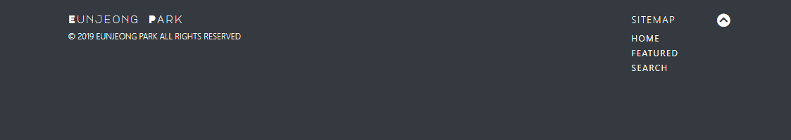

# 02 Web : 영화 추천 사이트 구성

## 0. Cinéma


&nbsp;

## 1. 레이아웃 구성

### 1) Navigation bar


* `position`과 `top`, `width`를 조절하여 navigation bar를 최상단에 sticky 하게 위치시켰습니다.

```css
#navbar {
    position: fixed;
    top: 0;
    width: 100%;
    z-index: 1;	/* 스크롤 이동 시 다른 컨텐츠를 덮게 하기 위함 */
}
```

* `collapse navbar-collapse` class에 속하는 nav-item들에서 `mr-auto`를 삭제한 뒤 `justify-content`를 통해 우측 정렬시켰습니다.

```css
.collapse .navbar-collapse {
    justify-content: flex-end;
}
```

* `<a>` 태그 class에 `disabled`를 추가하여 클릭이 불가능하게 만들었습니다. 


&nbsp;

### 2) Header


* `<header>` 안에 `<div class="container">`를 만들어 header를 구성했습니다.

```css
#cover {
    display: flex;
    padding-top: 40px;
    height: 350px;
    width: 100%;
    background-image: url('http://www.filmmonthly.com/wp-content/uploads/2014/11/mood_indigo.jpg');
    background-size: cover;
    background-position: center center;
    align-items: center;
    justify-content: center;
}
```

* subtitle은 `text-align`을 통해 중앙에 위치시켰습니다.

```css
.cover-title {
    font-size: 2.3rem;
    font-weight: 100;
    line-height: 1.4;
    text-align: center;
    color: white;
    letter-spacing: -1px;
}
```


&nbsp;

### 3) Footer



* `<footer>` 안에 `<div class="container">`를 만들어 footer를 구성했습니다.
* `<a>` 태그를 통해 상단으로 이동하는 아이콘을 만들었습니다.

```html
<a href="#cover">
	<span><i class="arrow-icon fas fa-chevron-circle-up fa-lg"></i></span>
</a>
```

* grid를 이용하여 `col-md-5` 영역에는 이름을 표기하고 `col-md-2 offset-md-5` 영역에는 사이트맵 링크를 나열했습니다.


&nbsp;

## 2. 영화 리스트 구성

### 1) Movie Card

* Bootstrap의 card를 이용해 영화 리스트를 구성했습니다. 반응형 디자인을 위해 각 card는 `<div class="my-2 col-lg-3 col-md-4 col-sm-5">` 태그 안에 만들었습니다.

* `col-lg-3`


* `col-md-4`


* `col-sm-5`


* `col-xs`


&nbsp;

## 3. 영화 상세보기

### 1) Modal


* 각 모달은 유니크한 `id` 값을 가지며 이 `id`는 영화 리스트 card의 `data-target` 속성과 연결됩니다.
* `modal-header` 안의 `modal-title` 에는 영화 국문명과 영문명을 작성했습니다.
* `modal-content` 안에 영화 이미지를 carousel로 구성했습니다.  각 carousel은 유니크한 `id`를 가지며 이 값은 carousel에서 이미지를 왼쪽이나 오른쪽으로 이동시킬 때 `href` 속성으로 연결될 값입니다.


