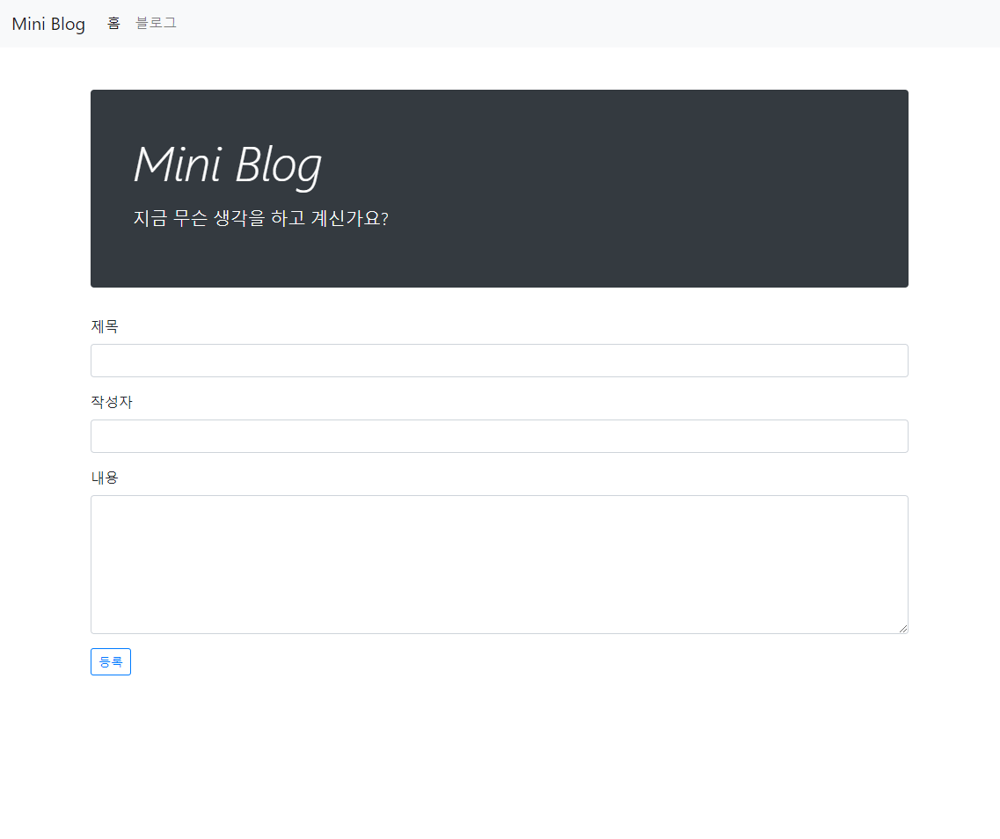
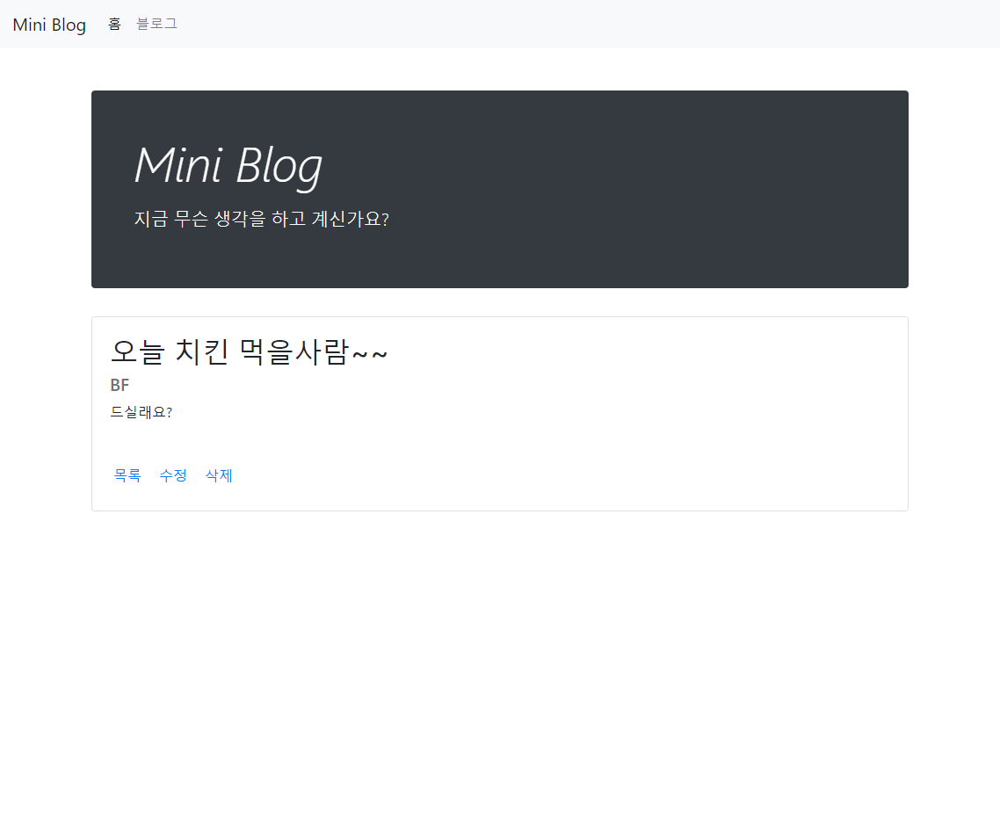

# Mini : 블로그 만들기
## 1. 데이터 베이스
```sql
CREATE TABLE articles (
    id INTEGER PRIMARY KEY AUTOINCREMENT,
    title TEXT NOT NULL,
    content TEXT NOT NULL,
    created_at TEXT,
    author TEXT NOT NULL
);
```

&nbsp;

## 2. 페이지
### 1. 글 목록


&nbsp;

### 2. 새 글 생성 Form



&nbsp;

### 3. 새 글 생성 


&nbsp;

### 4. 글 상세 페이지



&nbsp;

### 5. 글 수정 Form


&nbsp;

### 6. 글 수정


&nbsp;

### 7. 글 삭제