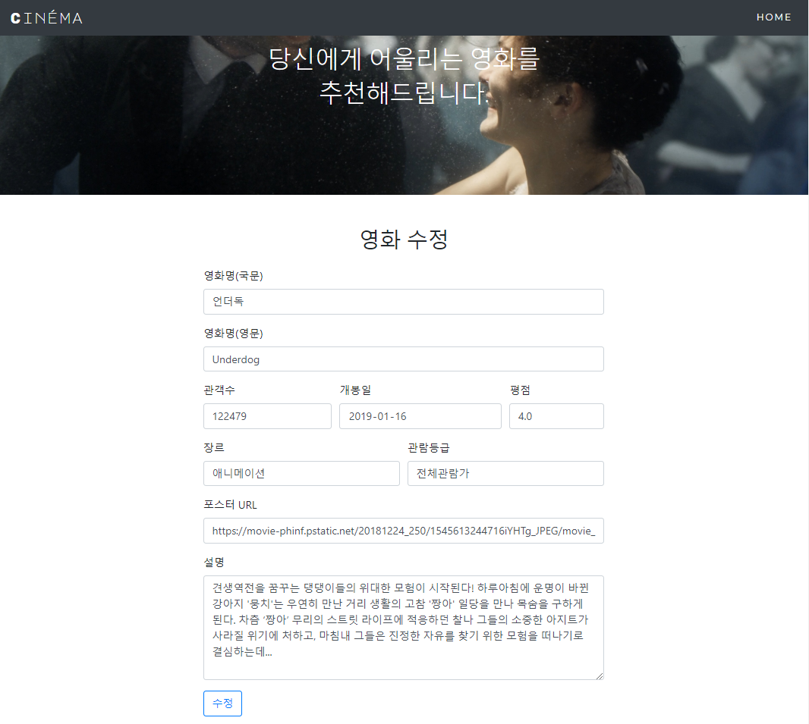

# 04 CRUD : Flask ORM

## 1. 데이터 베이스

### 1. Flask, SQLAlchemy 설정

```python
# Flask App 초기화
from flask import Flask, render_template, url_for, redirect, request
from flask_sqlalchemy import SQLAlchemy

app = Flask(__name__)

# app config
app.config['SQLALCHEMY_DATABASE_URI'] = 'sqlite:///db_flask.sqlite3'
app.config['SQLALCHEMY_TRACK_MODIFICATIONS'] = False

# DB init
db = SQLAlchemy(app)
db.init_app(app)
```


&nbsp;

### 2. Model 작성

```python
# Model
class Movie(db.Model):
    __tablename__ = 'movies'
    id = db.Column(db.Integer, primary_key=True)
    title = db.Column(db.String, nullable=False, unique=True)
    title_en = db.Column(db.String, nullable=False, unique=True)
    audience = db.Column(db.Integer, nullable=False)
    open_date = db.Column(db.String, nullable=False)
    genre = db.Column(db.String, nullable=False)
    watch_grade = db.Column(db.String, nullable=False)
    score = db.Column(db.Float, nullable=False)
    poster_url = db.Column(db.Text, nullable=False)
    description = db.Column(db.Text, nullable=False)
    
    def __init__(self, title, title_en, audience, open_date, genre, watch_grade, score, poster_url, description):
        self.title = title
        self.title_en = title_en
        self.audience = audience
        self.open_date = open_date
        self.genre = genre
        self.watch_grade = watch_grade
        self.score = score
        self.poster_url = poster_url
        self.description = description
        
db.create_all()
```


&nbsp;

## 2. 페이지

### 1. 영화 목록


```python
# 메인 페이지
@app.route('/')
def index():
    return redirect('/movies')
    
# 영화 목록
@app.route('/movies')
def movies():
    movies = Movie.query.order_by(Movie.id.desc()).all()
    return render_template('index.html', movies=movies)
```


&nbsp;

### 2. 영화 정보 생성


```python
# 영화 정보 생성 Form   
@app.route('/movies/new')
def new():
    return render_template('new.html')
    
# 영화 정보 생성
@app.route('/movies/create', methods=['POST'])
def create():
    if request.method == 'POST':
        result = request.form
    params = {
        'title': result.get('title'),
        'title_en': result.get('title_en'),
        'audience': result.get('audience'),
        'open_date': result.get('open_date'),
        'genre': result.get('genre'),
        'watch_grade': result.get('watch_grade'),
        'score': result.get('score'),
        'poster_url': result.get('poster_url'),
        'description': result.get('description')
    }
    movie = Movie(**params)
    db.session.add(movie)
    db.session.commit()
    return redirect('/movies')
```


&nbsp;

### 3. 영화 정보 조회


```python
# 영화 정보 조회
@app.route('/movies/<int:id>')
def show(id):
    mv = Movie.query.get(id)
    return render_template('show.html', mv=mv)
    
# 영화 정보 수정 Form
@app.route('/movies/<int:id>/edit')
def edit(id):
    mv = Movie.query.get(id)
    return render_template('edit.html', mv=mv)
```


&nbsp;

### 3. 영화 정보 수정



```python
# 영화 정보 수정
@app.route('/movies/<int:id>/update', methods=['POST'])
def update(id):
    if request.method == 'POST':
        result = request.form
    movie = Movie.query.get(id)
    movie.title = result.get('title')
    movie.title_en = result.get('title_en')
    movie.audience = result.get('audience')
    movie.open_date = result.get('open_date')
    movie.genre = result.get('genre')
    movie.watch_grade = result.get('watch_grade')
    movie.score = result.get('score')
    movie.poster_url = result.get('poster_url')
    movie.description = result.get('description')
    db.session.commit()
    return redirect('/movies')
```


&nbsp;

### 4. 영화 정보 삭제

```python
# 영화 정보 삭제
@app.route('/movies/<int:id>/delete')
def delete(id):
    movie = Movie.query.get(id)
    db.session.delete(movie)
    db.session.commit()
    return redirect('/movies')
```


&nbsp;

