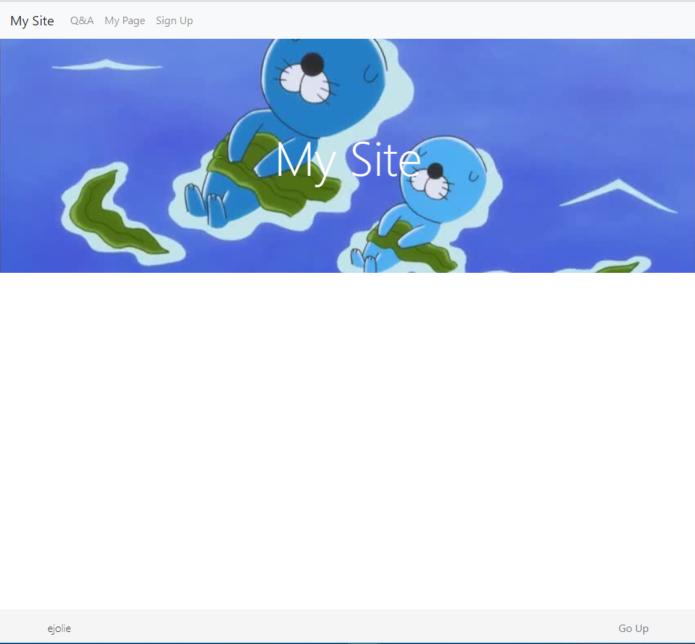
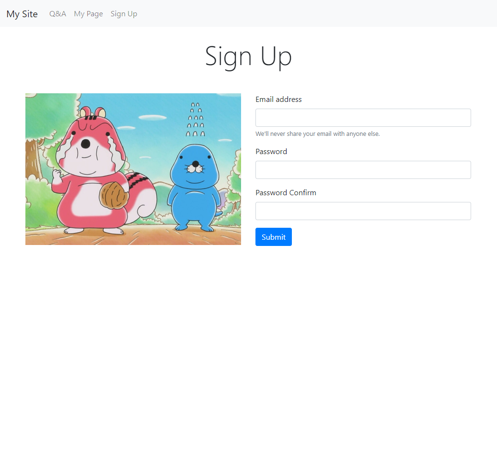

# 05 Detail : Django Template

## 1. `settings.py`
```python
ALLOWED_HOSTS = ["*"]

INSTALLED_APPS = [
    ...,
    'detail'
]

LANGUAGE_CODE = 'ko-KR'

TIME_ZONE = 'Asia/Seoul'
```

&nbsp;

## 2. `views.py`
```python
from django.shortcuts import render

def index(request):
    return render(request, 'index.html')
    
def mypage(request):
    return render(request, 'mypage.html')
    
def qna(request):
    return render(request, 'qna.html')
    
def signup(request):
    return render(request, 'signup.html')
    
def not_found(request, not_found):
    context = { 'path': not_found }
    return render(request, '404.html', context)
```

&nbsp;

## 3. `urls.py`
```python
from django.contrib import admin
from django.urls import path
from detail import views

urlpatterns = [
    path('admin/', admin.site.urls),
    path('', views.index),
    path('mypage/', views.mypage),
    path('qna/', views.qna),
    path('signup/', views.signup),
    path('<str:not_found>/', views.not_found)
]
```

&nbsp;

## 4. 페이지 구성

### 0) Favicon


&nbsp;

### 1) `/` 페이지

#### 화면




&nbsp;

#### 설계

* `Nav bar` 를 별도의 파일로 만들어 `base.html` 에 `include` 했고, 모든 페이지는 `base.html` 템플릿을 `extends` 합니다.

1. `base.html`

```html


<!DOCTYPE html>
<html lang="en">
<head>
    <meta charset="UTF-8">
    <meta name="viewport" content="width=device-width, initial-scale=1.0">
    <meta http-equiv="X-UA-Compatible" content="ie=edge">
    <!-- Favicon -->
    <link rel="shortcut icon" href="" type="image/x-icon">
    <link rel="icon" href="" type="image/x-icon">
    <!-- Bootstrap -->
    <link rel="stylesheet" href="https://stackpath.bootstrapcdn.com/bootstrap/4.3.1/css/bootstrap.min.css" integrity="sha384-ggOyR0iXCbMQv3Xipma34MD+dH/1fQ784/j6cY/iJTQUOhcWr7x9JvoRxT2MZw1T" crossorigin="anonymous">
    <script src="https://code.jquery.com/jquery-3.3.1.slim.min.js" integrity="sha384-q8i/X+965DzO0rT7abK41JStQIAqVgRVzpbzo5smXKp4YfRvH+8abtTE1Pi6jizo" crossorigin="anonymous"></script>
    <script src="https://cdnjs.cloudflare.com/ajax/libs/popper.js/1.14.7/umd/popper.min.js" integrity="sha384-UO2eT0CpHqdSJQ6hJty5KVphtPhzWj9WO1clHTMGa3JDZwrnQq4sF86dIHNDz0W1" crossorigin="anonymous"></script>
    <script src="https://stackpath.bootstrapcdn.com/bootstrap/4.3.1/js/bootstrap.min.js" integrity="sha384-JjSmVgyd0p3pXB1rRibZUAYoIIy6OrQ6VrjIEaFf/nJGzIxFDsf4x0xIM+B07jRM" crossorigin="anonymous"></script>
    <!-- My CSS file -->
    <link rel="stylesheet" href="">
    <title>My Site</title>
</head>
<body style="d-flex flex-column h-100">
    <!-- Nav bar -->
    
    <!-- Body block -->
    
    
</body>
</html>
```


2. `index.html`

```html


<!-- Header -->
<header id="mainHeader" class="d-flex justify-content-center align-items-center">
    <h1 id="mainTitle" class="display-3 m-0 text-center">My Site</h1>
</header>

<!-- Footer -->
<footer class="footer mt-auto py-3 position-fixed">
  <div class="container">
    <div class="row">
        <div class="col-3 d-flex align-items-start justify-content-start">
            <span class="font-weight-light pl-3">ejolie</span>
        </div>
        <div class="offset-6 col-3 d-flex align-items-start justify-content-end">
            <a class="text-muted pr-3" href="#">Go Up</a>
        </div>
    </div>
  </div>
</footer>

```

&nbsp;

### 2) `qna/` 페이지

#### 화면

1. Large Ver.


2. Small Ver.


&nbsp;

#### 설계

```html


<div class="container my-4">
<h1 class="display-4 mb-5 text-center">Q&A</h1>
<form method="POST">
  <div class="form-row">
    <div class="form-group col-md-6 col-lg-8">
      <label for="title">Title</label>
      <input type="text" class="form-control" id="title" name="title">
    </div>
    <div class="form-group col-md-6 col-lg-4">
      <label for="email">Email address</label>
      <input type="email" class="form-control" id="email" name="email">
    </div>
  </div>
  <div class="form-group">
  <label for="content">Content</label>
    <textarea class="form-control" id="content" rows="6" required></textarea>
  </div>
  <button type="submit" class="btn btn-primary">Submit</button>
</form>
</div>

```


&nbsp;

### 3) `mypage/` 페이지

#### 화면


&nbsp;

#### 설계

```html



<div class="container my-4">
    <h1 class="display-4 mb-5 text-center">My Page</h1>
    <div class="row">
        <!-- User profile -->
        <div class="col-lg-4 col-md-12 mb-5">
            <div class="card position-fixed" style="width: 18rem;">
              
              <div class="card-body">
                <h5 class="card-title">홍길동</h5>
                <h6 class="card-subtitle mb-2 text-muted">ssafy@ssafy.com</h6>
                <p class="card-text">Some quick example text to build on the card title and make up the bulk of the card's content.</p>
                <a href="#" class="card-link">Log Out</a>
              </div>
            </div>
        </div>
        <!-- Article list -->
        <div class="col-lg-8 col-md-12 mb-5">
            <div class="list-group">
              <a href="#" class="list-group-item list-group-item-action">
                <div class="d-flex w-100 justify-content-between">
                  <h5 class="mb-1">List group item heading</h5>
                  <small>3 days ago</small>
                </div>
                <p class="mb-1">Donec id elit non mi porta gravida at eget metus. Maecenas sed diam eget risus varius blandit.</p>
                <small>Donec id elit non mi porta.</small>
              </a>
			  ...중략...
            </div>
        </div>
    </div>
</div>

```

&nbsp;

### 4) `singup/` 페이지

#### 화면



&nbsp;

#### 설계

```html



<div class="container my-4">
    <h1 class="display-4 mb-5 text-center">Sign Up</h1>
    <div class="row">
        <div class="col-lg-6 mb-5">
            
        </div>
        <div class="col-lg-6 mb-5">
            <form>
              <div class="form-group">
                <label for="signupEmail">Email address</label>
                <input type="email" class="form-control" id="signupEmail" name="signupEmail" aria-describedby="emailHelp">
                <small id="emailHelp" class="form-text text-muted">We'll never share your email with anyone else.</small>
              </div>
              <div class="form-group">
                <label for="signupPassword">Password</label>
                <input type="password" class="form-control" id="signupPassword" name="signupPassword">
              </div>
              <div class="form-group">
                <label for="signupPasswordConfirm">Password Confirm</label>
                <input type="password" class="form-control" id="signupPasswordConfirm" name="signupPasswordConfirm">
              </div>
              <button type="submit" class="btn btn-primary">Submit</button>
            </form>
        </div>
    </div>
</div>

```

&nbsp;
### 5) `not_found` 페이지

#### 화면


&nbsp;

#### 설계
```html


<div class="container-fluid">
    <header id="notFoundHeader" class="d-flex justify-content-center align-items-center">
        <h1 class="display-4 text-center">{{ path }}는 없는 경로입니다.</h1>
    </header>
</div>

```

&nbsp;