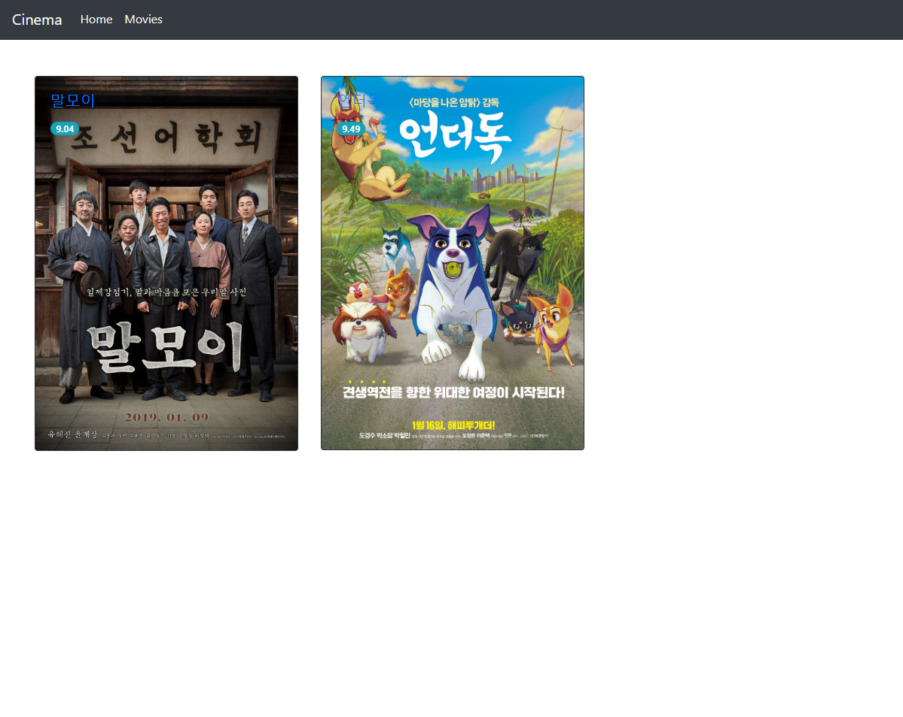
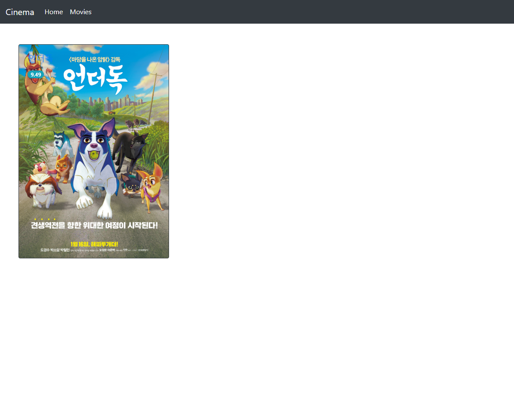

# 06 Django : CRUD


## 1. Models

### Movie

```python
from django.db import models
from django.core.validators import MaxValueValidator, MinValueValidator

class Movie(models.Model):
    title = models.CharField(max_length=50, unique=True)
    audience = models.IntegerField(validators=[MinValueValidator(0)])
    genre = models.CharField(max_length=20)
    score = models.FloatField(validators=[MinValueValidator(0), MaxValueValidator(10)])
    posterurl = models.URLField()
    description = models.TextField()
    
    def __str__(self):
        return '<' + self.title + ' | ' + self.audience + ' | ' + self.genre + ' | ' + self.score + ' | ' + self.posterurl + ' | ' + self.description + '>'
        
    def __repr__(self):
        return '<' + self.title + ' | ' + self.audience + ' | ' + self.genre + ' | ' + self.score + ' | ' + self.posterurl + ' | ' + self.description + '>'
```


&nbsp;

## 2. Views

### 1) 영화 목록 (메인 화면)

```python
def index(request):
    movies = Movie.objects.all()
    return render(request, 'movie/index.html', {'movies':movies})
```


&nbsp;

### 2) 영화 상세 정보 조회

```python
def detail(request, movie_id):
    movie = Movie.objects.get(id=movie_id)
    return render(request, 'movie/detail.html', {'movie':movie})
```


&nbsp;

### 3) 영화 정보 삭제

```python
def delete(request, movie_id):
    movie = Movie.objects.get(id=movie_id)
    movie.delete()
    return redirect('index')
```


&nbsp;
## 3. Templates

### 1) 영화 목록 (메인 화면)




&nbsp;

### 2) 영화 상세 정보 조회


&nbsp;


&nbsp;

### 3) 영화 삭제

영화 상세 정보 조회 페이지에서 삭제 버튼을 눌러 영화를 삭제 할 수 있습니다. 
삭제 버튼을 누르면 영화가 삭제되고 영화 목록 화면으로 redirect 됩니다.




&nbsp;
