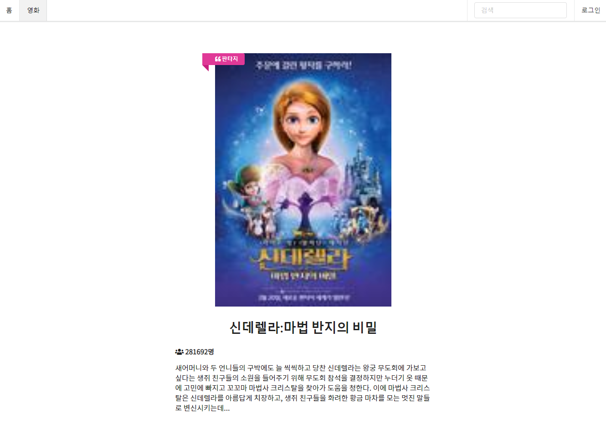
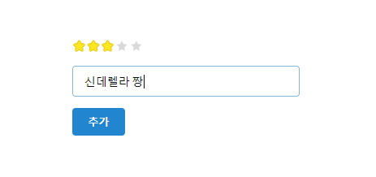
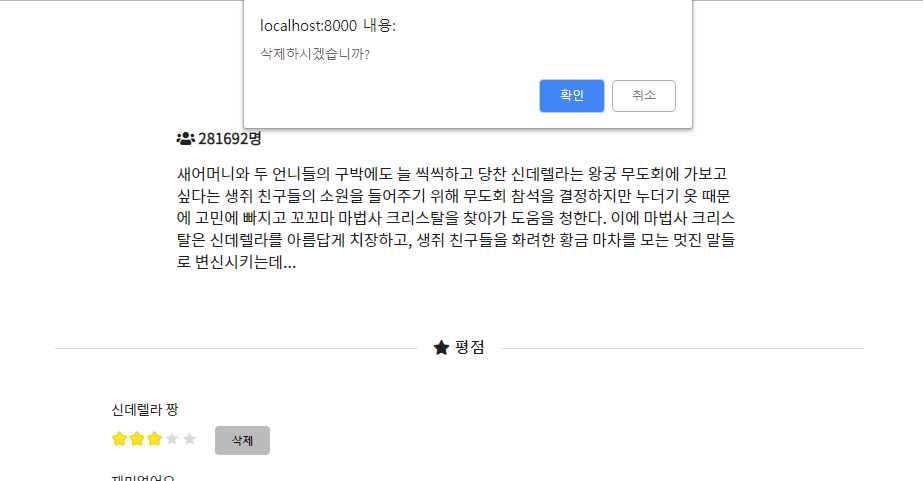

# 07 Django : Database

* Django
* Python : 3.7
* Semantic UI


## 1. Models

### 1) Genre

```python
class Genre(models.Model):
    name = models.CharField(max_length=50, default='')

    def __str__(self):
        return f'{self.id}: {self.name}'
```


&nbsp;

### 2) Movie

```python
class Movie(models.Model):
    title = models.CharField(max_length=150, default='')
    audience = models.IntegerField()
    poster_url = models.CharField(max_length=150, default='')
    description = models.TextField(default='')
    genre = models.ForeignKey(Genre, on_delete=models.CASCADE)

    def __str__(self):
        return f'''{self.id}: {self.title}, {self.audience}, {self.poster_url[:10]}\
            {self.description[:20]} - {self.genre}
            '''
```


&nbsp;

### 3) Score

```python
from django.core.validators import MinValueValidator, MaxValueValidator

class Score(models.Model):
    content = models.CharField(max_length=150, default='')
    score = models.IntegerField(validators=[MinValueValidator(0), MaxValueValidator(5)])
    movie = models.ForeignKey(Movie, on_delete=models.CASCADE)

    def __str__(self):
        return f'{self.movie} - {self.id}: {self.content[:10]}, {self.score}'
```

`validator`를 사용하여 `score`의 최솟값을 0으로, 최댓값을 5로 설정하였습니다.


&nbsp;

## 2. Views

### 1) 영화 리스트

```python
def movie_list(request):
    movies = Movie.objects.order_by('-id')
    return render(request, 'movies/list.html', {
        'movies': movies,
    })
```


&nbsp;

### 2) 영화 상세 정보 조회

`colors` 변수를 통해 각 장르마다 다른 색상의 라벨을 표시하도록 했습니다.

```python
def movie_detail(request, movie_id):
    movie = get_object_or_404(Movie, id=movie_id)
    scores = movie.score_set.order_by('-id')
    colors = [
        'red',
        'orange',
        'yellow',
        'olive',
        'green',
        'teal',
        'blue',
        'violet',
        'purple',
        'pink',
        'brown'
    ]
    color = colors[movie.genre.id-1]
    return render(request, 'movies/detail.html', {
        'movie': movie,
        'scores': scores,
        'color': color,
    })
```


&nbsp;

### 3) 영화 삭제

```python
def delete_movie(request, movie_id):
    movie = get_object_or_404(Movie, id=movie_id)
    if request.method == 'POST':
        movie.delete()
        return redirect('movies:movie_list')
    else:
        return redirect('movies:movie_detail', movie_id)
```


&nbsp;

### 4) 평점 생성

```python
def create_score(request, movie_id):
    movie = get_object_or_404(Movie, id=movie_id)
    if request.method == 'POST':
        score = Score.objects.create(
            content=request.POST.get('content'),
            score=int(request.POST.get('ratingNum')),
            movie_id=movie_id
        )
        score.movie_id = movie.id
    return redirect('movies:movie_detail', movie.id)
```


&nbsp;

### 5) 평점 삭제

```python
def delete_score(request, movie_id, score_id):
    movie = get_object_or_404(Movie, id=movie_id)
    score = get_object_or_404(Score, id=score_id)
    if request.method == 'POST':
        score.delete()
    return redirect('movies:movie_detail', movie.id)
```


&nbsp;

## 3. Templates

### 1) 영화 리스트


&nbsp;

### 2) 영화 상세 정보 조회

영화 상세 정보 화면에서는 영화 정보와 평점을 조회할 수 있습니다. 장르에 따라 포스터 위의 라벨 색상이 달라집니다.

#### 영화 상세 정보

* 신데렐라




&nbsp;

* 그린 북


&nbsp;

### 버튼


목록 버튼을 눌러 목록으로 돌아가거나 삭제 버튼을 눌러 삭제할 수 있습니다.


&nbsp;

### 3) 평점 조회

유저들이 등록한 평점과 리뷰를 조회할 수 있습니다. 평점 1점 당 별 한 개로 나타내었습니다. 


&nbsp;

이를 위해 jQuery 코드를 작성하였습니다. 이미 등록된 별은 readonly로 보이게 하고, 등록 칸에 있는 별은 마우스로 hover나 click을 하면 반응하도록 하였습니다.

```javascript
$(document).ready(function () {
    $('.rating').rating({ maxRating: 5 });
    $('#submitRating')
        .rating({
            initialRating: 0,
            maxRating: 5,
            onRate: function (rate) {
                $('#ratingNum').attr('value', rate);
            }
        })
    ;
    $('#ReadonlyRating')
        .rating('disable')
    ;
});
```


&nbsp;

### 4) 평점 등록

아래 칸에 별을 선택해 평점을 입력하고, 리뷰를 남길 수 있습니다. 




&nbsp;

### 5) 평점 삭제



평점 옆에 있는 `삭제` 버튼을 누르면 평점을 삭제할 수 있습니다.


&nbsp;