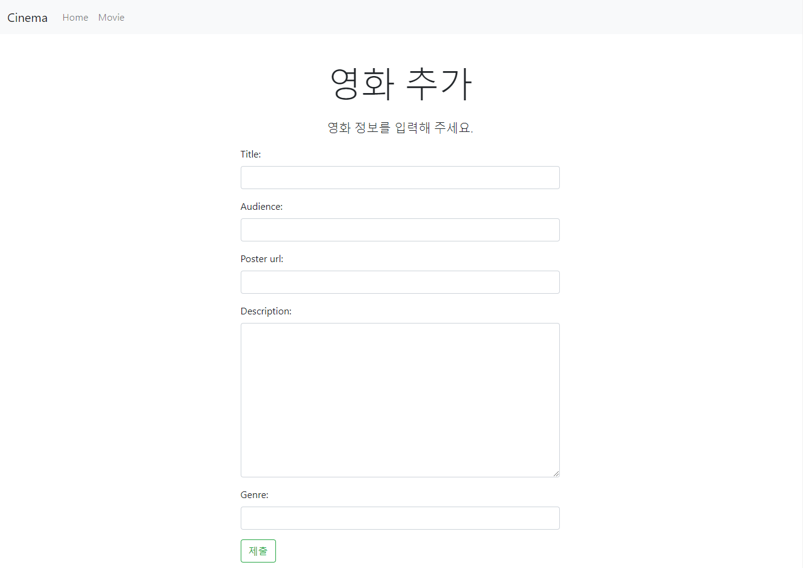
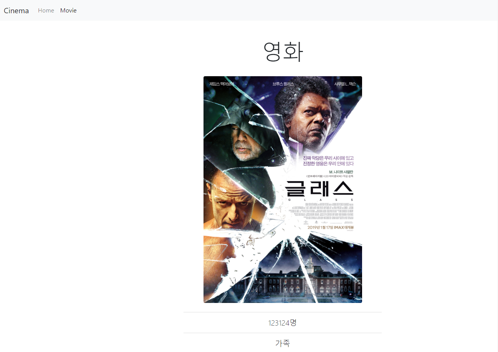
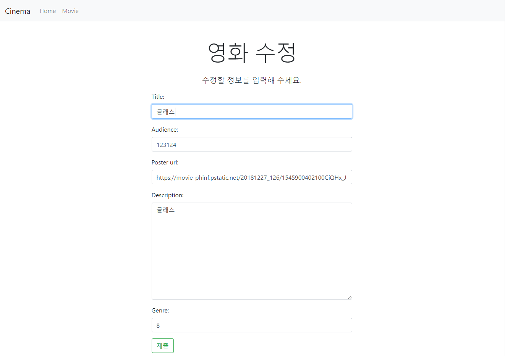
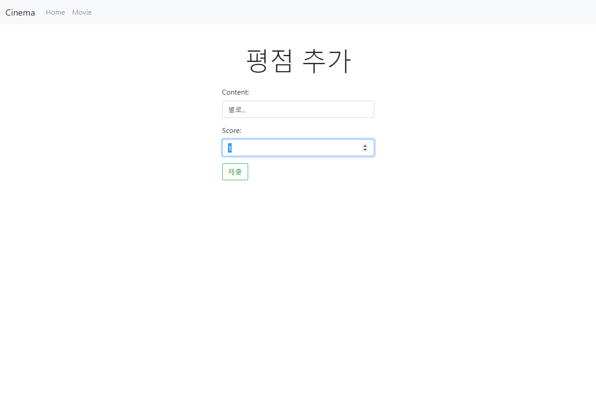

# 08 Django : Seed Data


## 1. Models

### 1) Genre

```python
class Genre(models.Model):
    name = models.CharField(max_length=50, default='')

    def __str__(self):
        return f'{self.id}: {self.name}'
```


&nbsp;

### 2) Movie

```python
class Movie(models.Model):
    title = models.CharField(max_length=150, default='')
    audience = models.IntegerField()
    poster_url = models.CharField(max_length=150, default='')
    description = models.TextField(default='')
    genre = models.ForeignKey(Genre, on_delete=models.CASCADE)

    def __str__(self):
        return f'''{self.id}: {self.title}, {self.audience}, {self.poster_url[:10]}\
            {self.description[:20]} - {self.genre}
            '''
```


&nbsp;

### 3) Score

```python
from django.core.validators import MinValueValidator, MaxValueValidator

class Score(models.Model):
    content = models.CharField(max_length=150, default='')
    score = models.IntegerField(validators=[MinValueValidator(0), MaxValueValidator(5)])
    movie = models.ForeignKey(Movie, on_delete=models.CASCADE)

    def __str__(self):
        return f'{self.movie} - {self.id}: {self.content[:10]}, {self.score}'
```

`validator`를 사용하여 `score`의 최솟값을 0으로, 최댓값을 5로 설정하였습니다.


&nbsp;

## 2. Views

### 1) 영화 목록 (메인 화면)

```python
def home(request):
    movies = Movie.objects.order_by('-id')
    return render(request, 'movies/list.html', {
        'movies': movies
    })
```


&nbsp;

### 2) 영화 상세 정보 조회

```python
def movie_detail(request, movie_id):
    movie = Movie.objects.get(id=movie_id)
    scores = movie.score_set.order_by('-id')
    return render(request, 'movies/detail.html', {
        'movie': movie,
        'scores': scores
    })
```


&nbsp;

### 3) 영화 생성

```python
def create_score(request, movie_id):
    movie = get_object_or_404(Movie, id=movie_id)
    score = Score(movie=movie)
    if request.method == 'POST':
        form = ScoreModelForm(request.POST, instance=score)
        if form.is_valid():
            form.save()
            return redirect('movies:movie_detail', movie.id)
    else:
        form = ScoreModelForm()
        return render(request, 'movies/score.html', {
            'form': form,
            'movie': movie,
        })
```


&nbsp;

### 4) 영화 수정

```python
def update_movie(request, movie_id):
    movie = get_object_or_404(Movie, id=movie_id)
    if request.method == 'POST':
        form = MovieModelForm(request.POST, instance=movie)
        if form.is_valid():
            movie = form.save()
            movie.save()
        return redirect('movies:movie_detail', movie.id)
    else:
        form = MovieModelForm(instance=movie)
        return render(request, 'movies/form.html', {
            'form': form,
            'header': '영화 수정',
            'lead': '수정할 정보를 입력해 주세요.',
            'action': 'update_movie',
        })
```


&nbsp;

### 5) 영화 삭제

```python
def delete_movie(request, movie_id):
    movie = get_object_or_404(Movie, id=movie_id)
    movie.delete()
    return redirect('movies:home')
```


&nbsp;

### 6) 평점 생성

```python
def create_score(request, movie_id):
    movie = get_object_or_404(Movie, id=movie_id)
    score = Score(movie=movie)
    if request.method == 'POST':
        form = ScoreModelForm(request.POST, instance=score)
        if form.is_valid():
            form.save()
            return redirect('movies:movie_detail', movie.id)
    else:
        form = ScoreModelForm()
        return render(request, 'movies/score.html', {
            'form': form,
            'movie': movie,
        })
```


&nbsp;

## 3. Templates

### 1) 영화 목록 (메인 화면)


&nbsp;

### 2) 영화 생성




&nbsp;

### 3) 영화 수정

* 영화 상세 정보 조회 화면




&nbsp;

* 하단에 있는 버튼을 통해 영화 정보를 수정할 수 있습니다.


&nbsp;

* 영화 수정 Form




&nbsp;

### 4) 평점 생성

* 영화 상세 정보 조회 화면 아래 버튼을 통해 평점을 생성할 수 있습니다.


&nbsp;

* 평점 생성 Form



&nbsp;