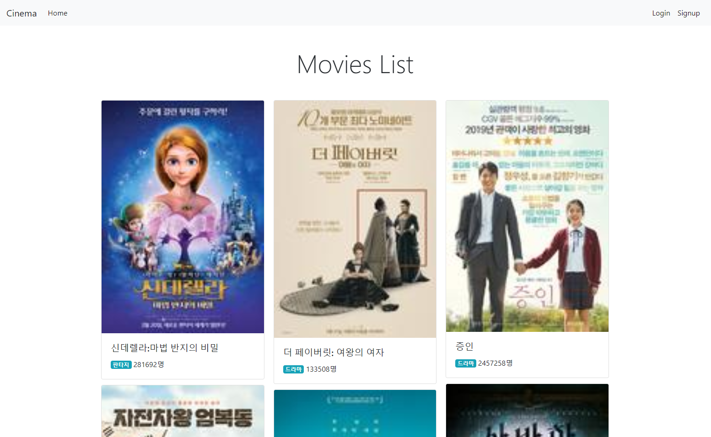
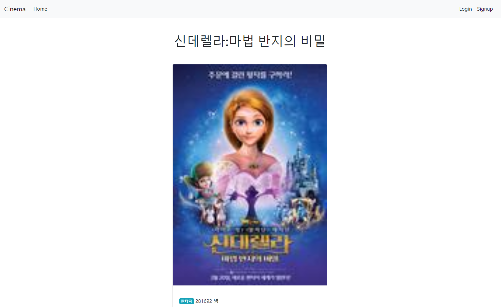
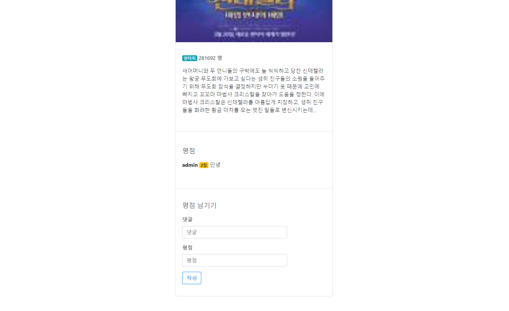
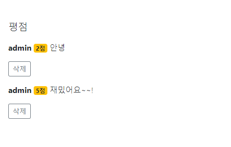
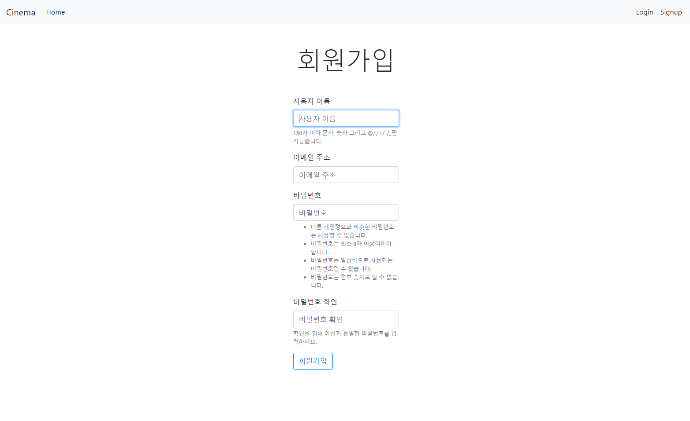
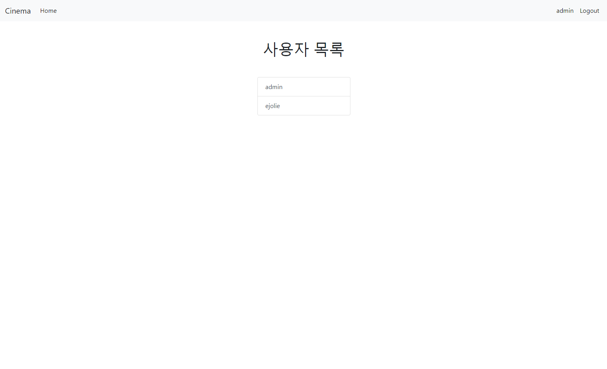
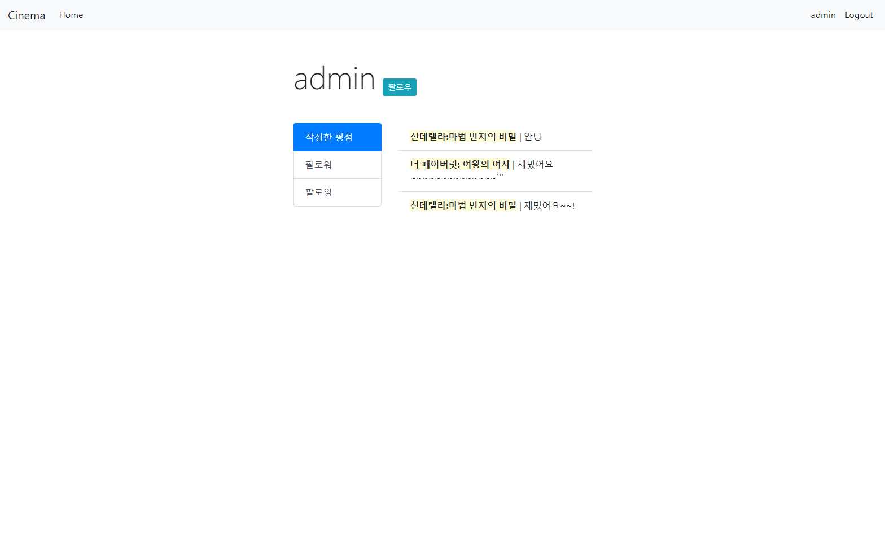

# 09 Django : M to N


## 1. Models

### 1) movies app

#### Genre

```python
class Genre(models.Model):
    name = models.CharField(max_length=20)

    def __str__(self):
        return self.name
```


&nbsp;

#### Movie

```python
class Movie(models.Model):
    title = models.CharField(max_length=30)
    audience = models.IntegerField()
    poster_url = models.TextField()
    description = models.TextField()
    genre = models.ForeignKey(Genre, on_delete=models.CASCADE)

    def __str__(self):
        return self.title
```


&nbsp;

#### Score

```python
class Score(models.Model):
    content = models.CharField(max_length=100)
    value = models.IntegerField()
    movie = models.ForeignKey(Movie, on_delete=models.CASCADE)
    user = models.ForeignKey(settings.AUTH_USER_MODEL, on_delete=models.CASCADE)

    def __str__(self):
        return self.user + self.movie + self.content
```


&nbsp;

### 2) accounts app

#### User

```python
class User(AbstractUser):
    def __str__(self):
        return self.username
```


&nbsp;

#### User_Followers_User

```python
class User_Followers_User(models.Model):
    from_user = models.ManyToManyField(settings.AUTH_USER_MODEL, related_name='to_users')
```


&nbsp;

## 2. Views

### 1) movies app

#### 영화 목록 (메인 화면)

```python
def list(request):
    movies = Movie.objects.order_by('-id')
    return render(request, 'movies/list.html', {
        'movies': movies,
    })
```


&nbsp;

#### 영화 상세 정보 조회

```python
def detail(request, movie_pk):
    movie = Movie.objects.get(pk=movie_pk)
    score_form = ScoreForm()
    return render(request, 'movies/detail.html', {
        'movie': movie,
        'score_form': score_form,
    })
```


&nbsp;

#### 평점 생성

```python
@login_required
@require_POST
def create_score(request, movie_pk):
    score_form = ScoreForm(request.POST)
    if score_form.is_valid():
        score = score_form.save(commit=False)
        score.user = request.user
        score.movie_id = movie_pk
        score.save()
    return redirect('movies:detail', movie_pk)
```


&nbsp;

#### 평점 삭제

```python
@login_required
@require_POST
def delete_score(request, movie_pk, score_pk):
    score = get_object_or_404(Score, pk=score_pk)
    if score.user != request.user:
        return HttpResponseForbidden("You are not allowed to delete this Comment")
    score.delete()
    return redirect('movies:detail', movie_pk)
```


&nbsp;

### 2) accounts app

#### 유저 목록

```python
def list(request):
    users = User.objects.all()
    return render(request, 'accounts/list.html',{
        'users': users
    })
```


&nbsp;

#### 유저 상세보기

```python
def profile(request, user_pk):
    user = User.objects.get(pk=user_pk)
    followings = []
    followers = []
    return render(request, 'accounts/profile.html', {
        'user': user,
        'followers': followers,
        'followings': followings,
    })
```


&nbsp;

## 3. Templates

### 1) movies app

#### 영화 목록 (메인 화면)




&nbsp;

#### 영화 상세 정보 조회




&nbsp;




&nbsp;

#### 평점 생성

로그인을 하면 평점을 생성할 수 있습니다.


&nbsp;

#### 평점 삭제

삭제 버튼을 눌러 자신이 남긴 평점을 삭제할 수 있습니다.




&nbsp;

### 2) accounts app

#### 회원가입

상단 네비게이션 바 오른쪽에 있는 `Signup` 버튼을 눌러 회원가입을 할 수 있습니다.




&nbsp;

#### 로그인

상단 네비게이션 바 오른쪾에 있는 `Login` 버튼을 눌러 로그인을 할 수 있습니다.


&nbsp;

#### 유저 목록

유저 목록을 조회할 수 있습니다. 유저 아이디를 클릭하면 유저 상세보기 페이지로 넘어갑니다.




&nbsp;

#### 유저 상세보기

유저의 활동 현황을 조회할 수 있습니다.




&nbsp;