# 🤸🏻‍♀️ Web Projects

This repository is for practice of making websites with Flask, Django and Bootstrap. 

See each project directory for details 🔍

## 1. Python

Collect and process movie data for the last 10 weeks using Python.

### Built with

- requests
- BeautifulSoup

- 영화진흥위원회 API
- Naver movie API 

&nbsp;

## 2. Web

Create a movie portal site with the movie data processed at 1st project.

### Built with

- Bootstrap

### Screenshots

* 메인 화면

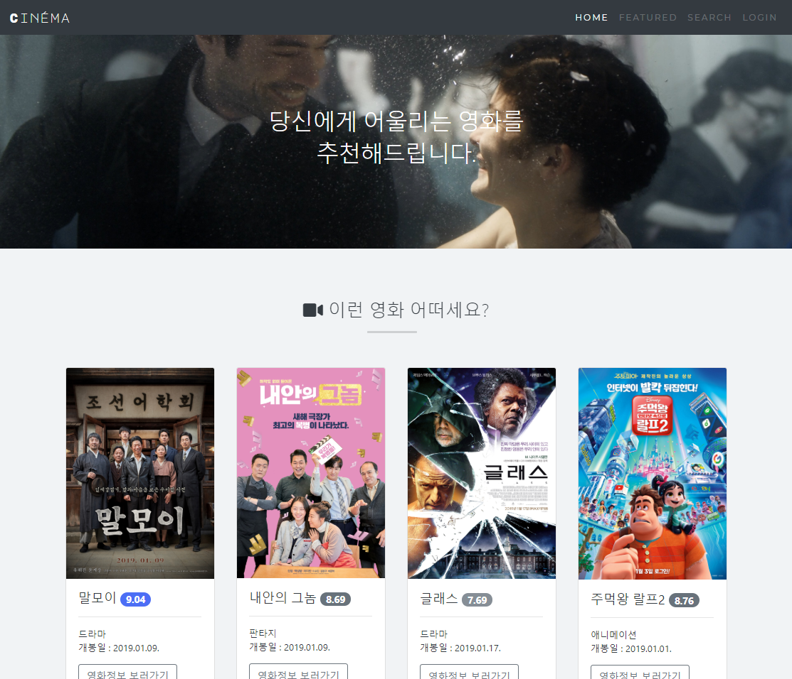

* Footer

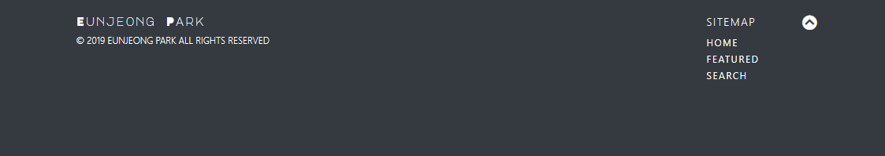

&nbsp;

## 3. SQL

Practice SQLite query.

### Built with

- SQLite

&nbsp;

## Mini project. CRUD Blog

Create a mini CRUD blog usign Flask.

### Built with

- Flask
- SQLite
- Bootstrap

### Screenshots

* 메인 화면

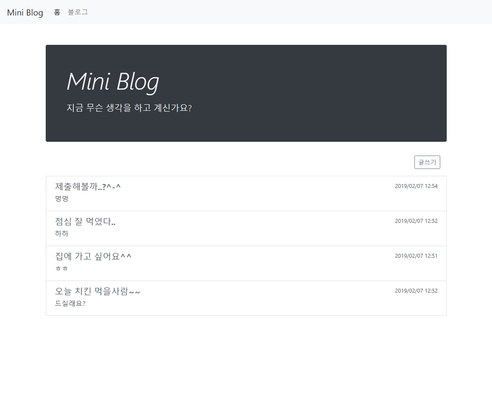

* 글 상세 조회

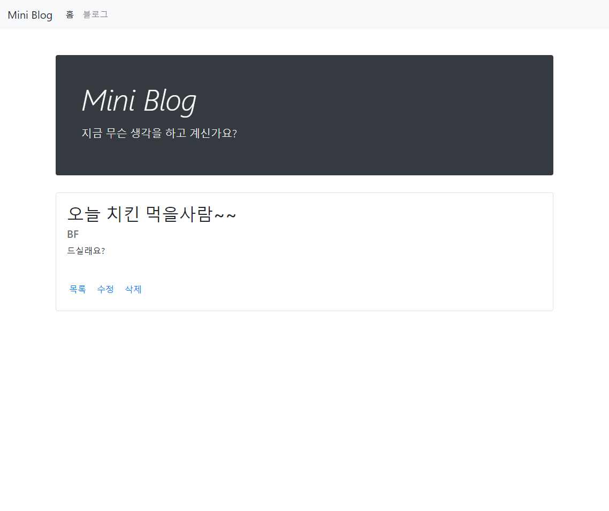

&nbsp;

## 4. CRUD ORM

Create a movie portal site similar to 2nd project using **Flask**.

### Built with

- Flask
- SQLAlchemy
- Bootstrap

### Screenshots

* 영화 수정

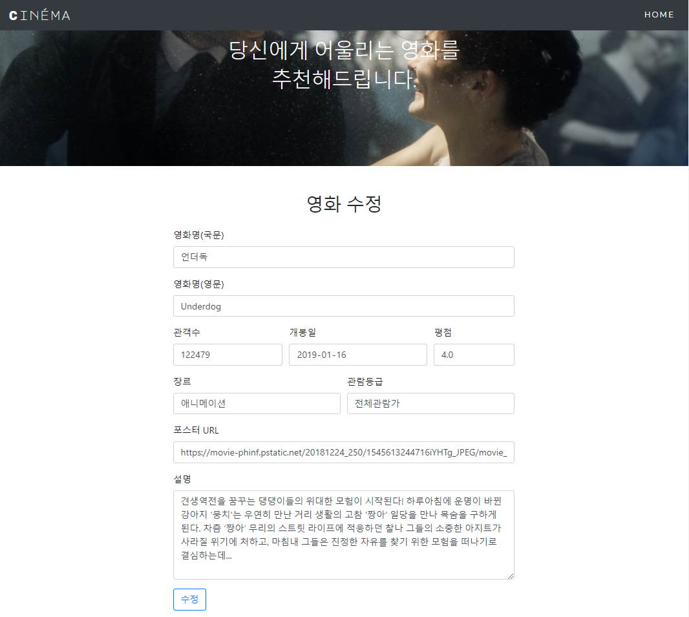

&nbsp;

## 5. CRUD Template

Create a website template for CRUD using Django.

### Built with

- Django
- Bootstrap

### Screenshots

- 메인 화면

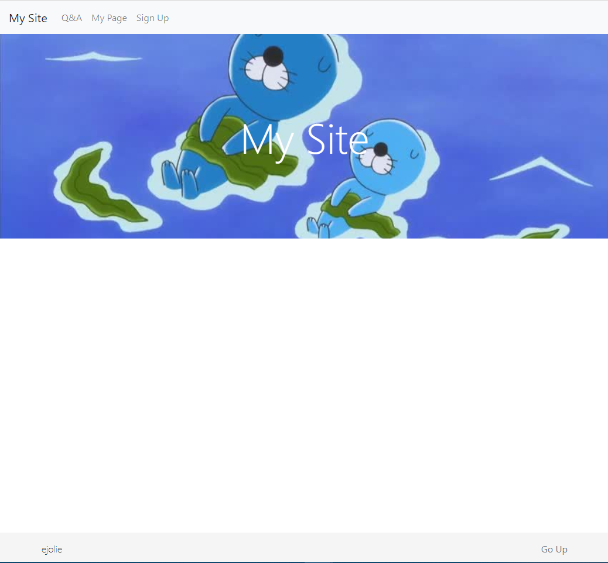

* 회원가입

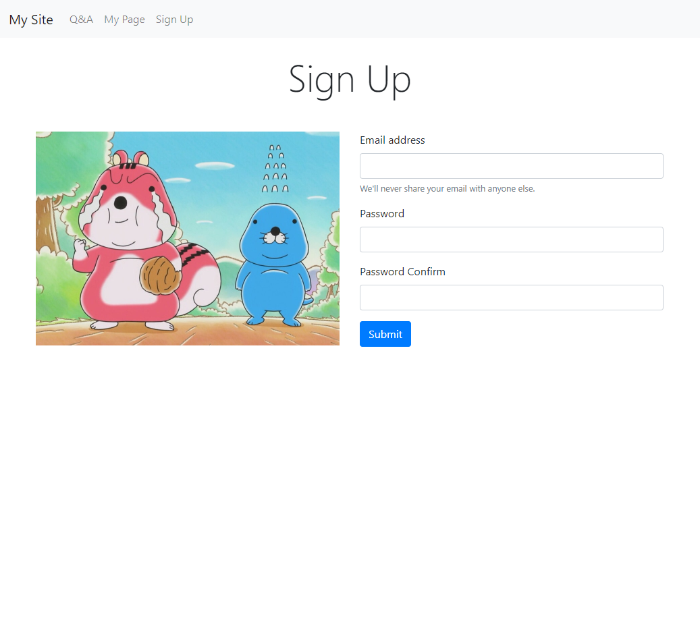

&nbsp;

## 6. Django CRUD

Create a CRUD movie portal site using Django.

### Built with

- Django
- Bootstrap

### Screenshots

- 영화 수정 및 삭제

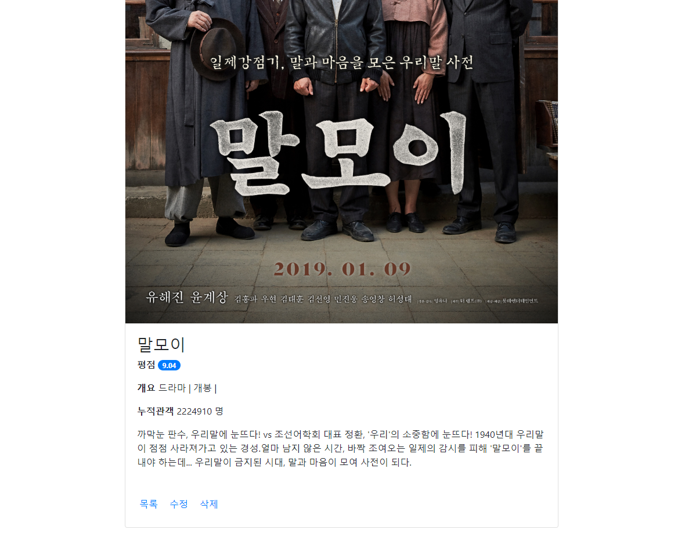

&nbsp;

## 7. Django DB

Create a movie portal site usign Django ORM.

### Built with

* Django
* Semantic UI

### Screenshots

* 메인 화면

* 평점 등록 및 삭제

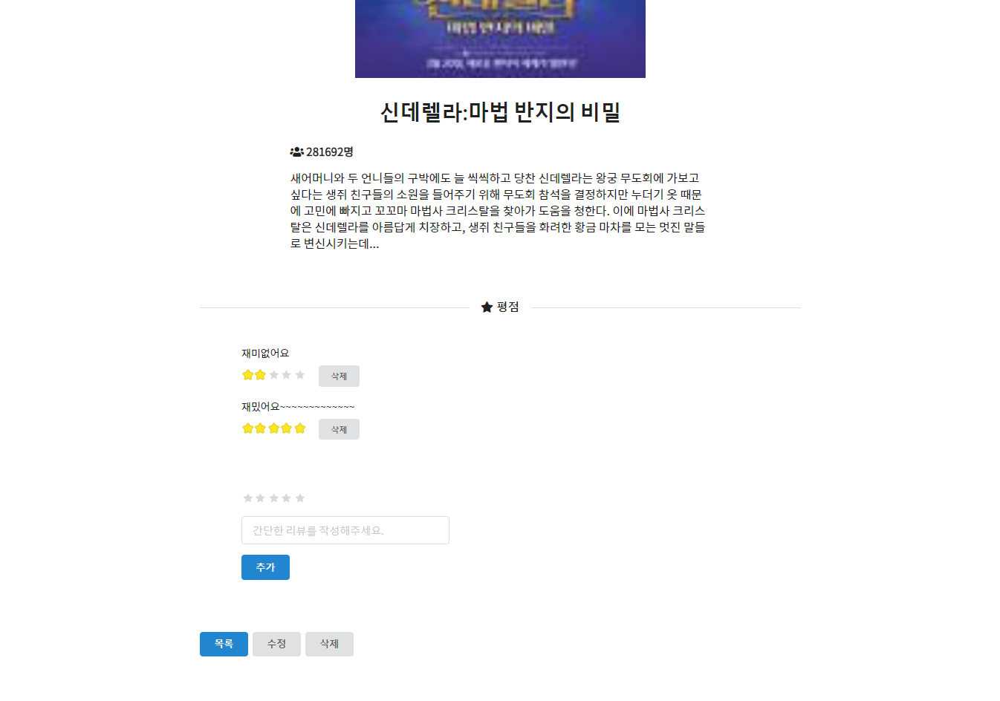

&nbsp;

## 8. Django Seed

Create a movie portal site using Django ORM.

### Built with

- Django
- Bootstrap

### Screenshots

- 메인 화면

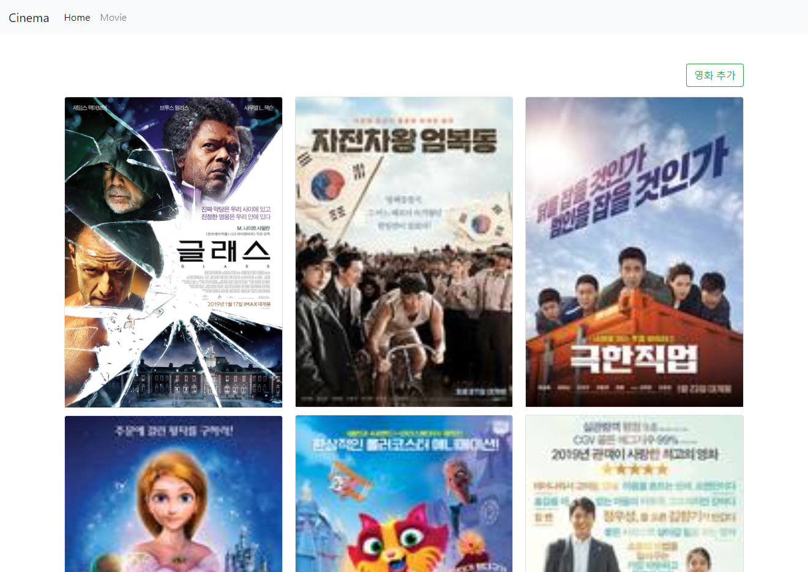

* 평점 생성

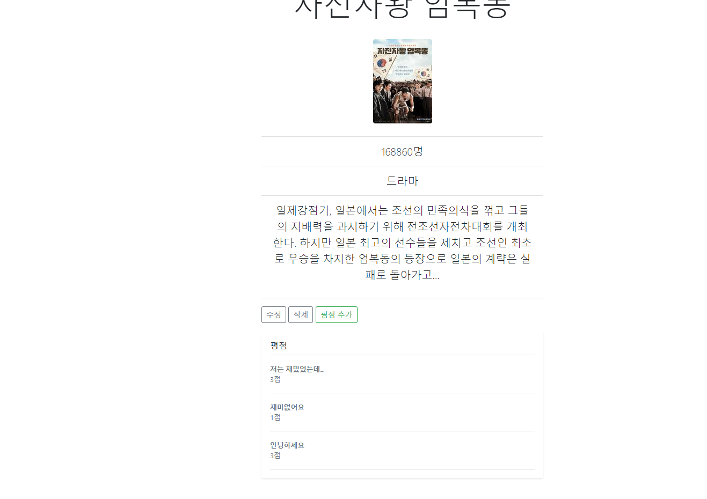

&nbsp;

## 9. Django M : N

Create a movie portal site using Django ORM and implement signup/login/logout.

### Built with

- Django
- Bootstrap

### Screenshots

* 로그인

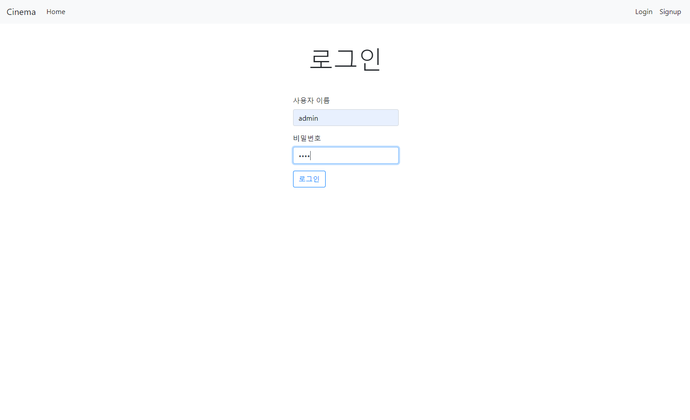

* 평점 생성

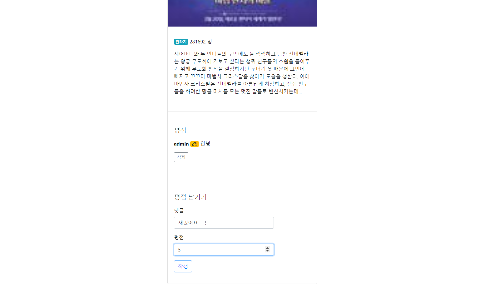

&nbsp;

