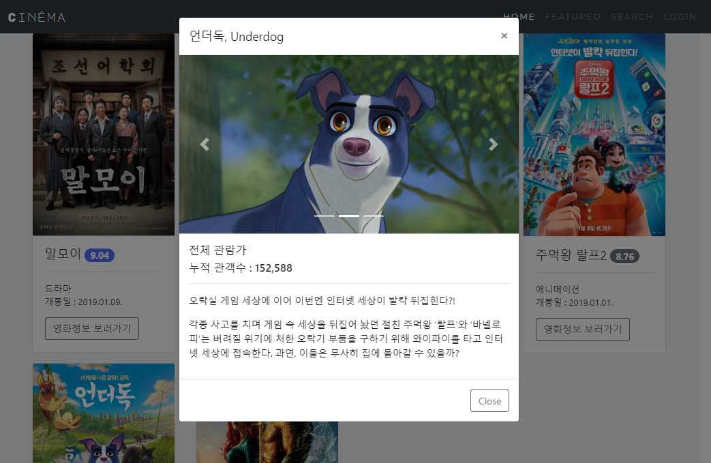

# 🤸🏻‍♂️ Web Projects

This repository is for practice making websites with Flask, Django and Bootstrap. 

See each project directory for details 🔍

## 1. Python

Collect and process movie data for the last 10 weeks using Python.

### Built with

- requests
- BeautifulSoup

- 영화진흥위원회 API
- Naver movie API 

&nbsp;

## 2. Web

Create a movie portal site with the movie data processed at 1st project.

### Built with

- Bootstrap

### Screenshots

* 메인 화면

* 모달

* Footer

&nbsp;

## 3. SQL

Practice SQLite query.

### Built with

- SQLite

&nbsp;

## Mini project. CRUD Blog

Create a mini CRUD blog usign Flask.

### Built with

- Flask
- SQLite
- Bootstrap

### Screenshots

* 메인 화면

&nbsp;

## 4. CRUD ORM

Create a movie portal site similar to 2nd project using **Flask**.

### Built with

- Flask
- SQLAlchemy
- Bootstrap

### Screenshots

* 메인 화면

* 영화 수정

&nbsp;

## 5. CRUD Template

Create a website template for CRUD using Django.

### Built with

- Django
- Bootstrap

### Screenshots

- 메인 화면

* 회원가입

&nbsp;

## 6. Django CRUD

Create a CRUD movie portal site using Django.

### Built with

- Django
- Bootstrap

### Screenshots

- 영화 상세 정보 조회

* 영화 수정 및 삭제

&nbsp;

## 7. Django DB

&nbsp;

## 8. Django Seed

&nbsp;

## 9. Django M : N

